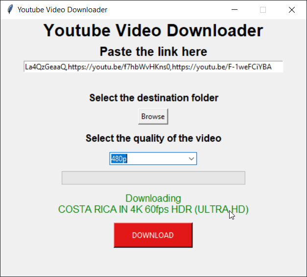
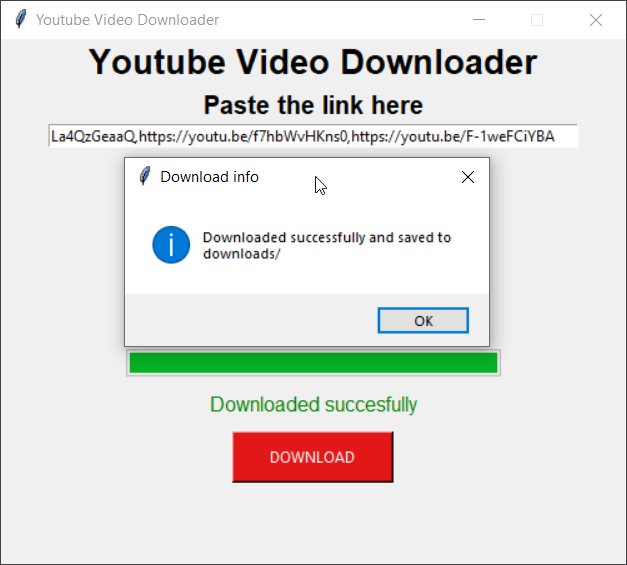

# YouTube-Multi-Video-Scraper
It is an application which helps to download videos from YouTube in a bulk.

## GUI
The basic GUI of the tool looks like this. 

## Working
Paste the links of the YouTube videos you want to download, separated by commas(,).

Then choose the destination folder and select the quality in which you want to download the video.

Then hit the DownLoad button. It will start extracting the videos from youtube and downloading them one by one.

After succesfully download all the videos, it will show a dialog box as confirmation.

